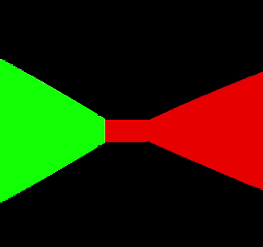

# A simple 3D raycaster
A project for testing how raycasting works.

## About raycasting
Raycasting is a popular 3D rendering method used in the first 3D games back in the 90's, like Doom or Wolfenstein 3D. It consists in tracing rays from the player POV to the objects in front of it, one ray per pixel in the X axis. Then, the segment length is calculated, and used for rendering these objects on the screen. It's a really simple method, but I find it a fun project to do for starting in the 3D rendering and computer graphics world.

## Current status:
Improved the input system and added more modularity. Bugs will be fixed soon\
<a href="url"></a>

## To-do:
- Fix some bugs in the rendering.
- Add collisions.
- Make the code more modular.
- Add textures.
- Add UI.
- Fix the framerate drop when using larger screen resolution.
- Game mechanics????

## How to use it
Simply use the ```make``` command to compile the project. Then, run the binary file in the ./bin folder using ```./bin/raycaster```. Make sure you have the SDL2 library installed on your system.

## Controls
- W and S to move the player.
- A and D to move the camera.
- M to show the map.
- Q to quit the game.

Big thanks to user [ssloy](https://github.com/ssloy) for creating the [tinyraycaster](https://github.com/ssloy/tinyraycaster) guide. It has been a really useful resource for learning how this method works.
