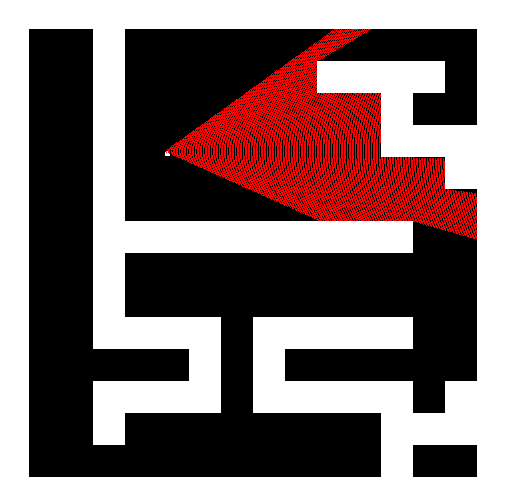

# A simple 3D raycaster
A project for testing how raycasting works.

### About raycasting
Raycasting is a popular 3D rendering method used in the first 3D games back int the 90s, like Doom or Wolfenstein 3D. It consists in tracing rays from the player POV to the objects in front of it, one ray per pixel in the X axis. Then, the segment length is calculated, and used for rendering these objects on the screen. It's a really simple method, but is a fun project to do for starting in the 3D rendering and computer graphics world.

### Current status:
I've implemented the player and the rays in the map. These rays will calculate the distance between the player and the objects in front of it.


### To-do:
- Start rendering the vertical lines for the 3D view.
- Make the code more modular.
- Add colors and textures.
- Improve input system.
- Add UI.
- Game mechanics????

### How to use it
Simply use the ```make``` command to compile the project. Then, run the binary file in the ./bin folder using ```./bin/raycaster```. Make sure you have the SDL2 library installed on your system.

Big thanks to user [ssloy](https://github.com/ssloy) for creating the [tinyraycaster](https://github.com/ssloy/tinyraycaster) guide. It has been a really useful resource for learning how this method works.
